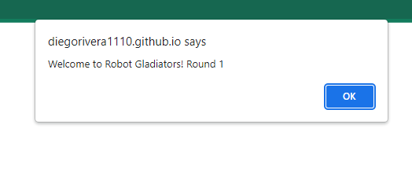

# Robot Gladiators

  ## Description
  This project is built almost entirely out of JavaScript using primarily window alerts to allow the user to name a robot that will go against three opponents in which the user can choose to "FIGHT" or "SKIP" at the beginning of each turn.

  Link https://diegorivera1110.github.io/robot-gladiators/

  ## Screenshot
  

  ## Table of Contents
  - [Installation](#installation)
  - [Usage](#usage)
  - [Credits](#credits)
  - [License](#license)
  - [Tests](#tests)
  - [Questions](#questions)

  ## Installation
  All you will need to do in order to install this project is clone the repo and once opened in your code editor you can click "run and debug" or right-click and press "open in default browser" and the window with the game running will start.

  ## Usage
  This project was used to build this simple JavaScript game that showcases different functionality in an application using only JavaScript. 

  ## Credits
  Made with <3 by Diego Rivera

  ## License
   
  To read more on the license, [The Unlicense](http://unlicense.org/)

  ## Tests
  
  
  # Questions

  ## GitHub: 
  Account Name: diegorivera1110  
  Link: https://github.com/Diegorivera1110

  ## Email Address: 
  diegorivera1110@gmail.com

